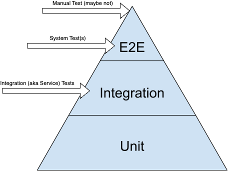

# Test Container Network for Go


A set of helper types and methods to abstract out boilerplate code
for writing integration- and system-level tests for AWS services using [testcontainers in Go](https://github.com/testcontainers/testcontainers-go). Currently supported are:
 
* DynamoDbDockerContainer - a container for a DynamoDB data store
* FlywayDockerContainer - a Flyway container for provisioning database containers
* LambdaDockerContainer - a container that runs a Lambda function
* PostgresDockerContainer - a container for an Postgres Database in AWS RDS
* SnsDockerContainer - a container that runs an AWS Simple Notification Service server
* SqsDockerContainer - a container that runs an AWS Simple Queue Service server
* WiremockDockerContainer - a container that runs a Wiremock server, great for simulating external APIs and AWS's Systems Manager Parameter Store

## Rationale

I am going to willfully paraphrase from Ham Vocke, who sums this up perfectly in [The Practical Test Pyramid](https://martinfowler.com/articles/practical-test-pyramid.html#IntegrationTests):

_All non-trivial applications [in this case an AWS Lambda] will integrate with some other parts (databases, filesystems, network calls to other applications). When writing unit tests these are usually the parts you leave out in order to come up with better isolation and faster tests. Still, your application will interact with other parts and this needs to be tested. Integration Tests are there to help. They test the integration of your application with all the parts that live outside of your application.

For your automated tests this means you don't just need to run your own application but also the component you're integrating with. If you're testing the integration with a database you need to run a database when running your tests. For testing that you can read files from a disk you need to save a file to your disk and load it in your integration test._

Referring to the test pyramid, integration tests sit in the middle, and the term _service tests_ is often used interchangeably:



I go with that, we are generally testing a service's integration between itself and other external services, some of which we may have also written ourselves.  In this example, we have a single AWS Lambda service that interacts with a number of other AWS services and an external API service (non-AWS).  A diagram of the Lambda service under test probably indicates this the best:



## Testing

You will need to have some credentials in your AWS credentials file.  You can set them up using the AWS CLI tool thus (the values are relatively arbitrary for this):

```shell
aws configure
AWS Access Key ID [None]: X
AWS Secret Access Key [None]: Y
Default region name [None]: us-east-1
Default output format [None]: 
```

```shell
make test
```

The tests can also be run directly from within an IDE, such as GoLand, by running the func _TestDockerContainerNetwork_ in [containers_test.go](containers_test.go).

## Using

```go
package main

import "github.com/mikebharris/testcontainernetwork-go"
import "time"

func main() {
	wiremockContainer := WiremockDockerContainer{
		Config: WiremockDockerContainerConfig{
			Hostname:     wiremockHostname,
			Port:         wiremockPort,
			JsonMappings: "test-assets/wiremock/mappings",
		},
	}

	lambdaContainer := LambdaDockerContainer{
		Config: LambdaDockerContainerConfig{
			Hostname:   "lambda",
			Executable: "path/to/lambda/bootable",
			Environment: map[string]string{
				"API_ENDPOINT":        fmt.Sprintf("http://%s:%d", wiremockHostname, wiremockPort),
			},
		},
	}

	networkOfDockerContainers :=
		NetworkOfDockerContainers{}.
			WithDockerContainer(&lambdaContainer).
			WithDockerContainer(&wiremockContainer)
	
	err := networkOfDockerContainers.StartWithDelay(5 * time.Second)
	if err != nil {
        log.Fatalf("starting network of Docker containers: %v", err)
    }
}
```

## Clients

There is a client for some container types that provides a simple way to interact with the container. For example, the SQS client provides methods to receive messages from the SQS server:

```go
package main

import "github.com/mikebharris/testcontainernetwork-go/clients"

func main() {
	sqsClient, _ := clients.SqsClient{}.New(s.sqsContainer.MappedPort())
	if err != nil {
		log.Fatalf("creating SQS client: %v", err)
	}

	messagesOnQueue, err := sqsClient.GetMessagesFrom(sqsQueueName)
	if err != nil {
		log.Fatalf("getting messages from SQS: %v", err)
	}
}
```

## Implementing a new container

The container should _promote_ the values and methods of _DockerContainer_ and implement the
_StartableDockerContainer_ interface, which gets you the internal reference to the testcontainer and the port for the
service, as well as the _MappedPort()_ method. For example:

```go

type MyDockerContainerConfig struct {
Hostname   string
ConfigFile string
Port       int
}

type MyDockerContainer struct {
DockerContainer
Config MyDockerContainerConfig
}

func (c *MyDockerContainer) Stop(ctx context.Context) error {
....
}

func (c *LambdaDockerContainer) StartUsing(ctx context.Context, dockerNetwork *testcontainers.DockerNetwork) error {
....
}

```

I recommend that container-specific configuration parameters be assigned as a struct to the Config field, thus keeping
the container struct itself clean and simple and the same across different container implementations.